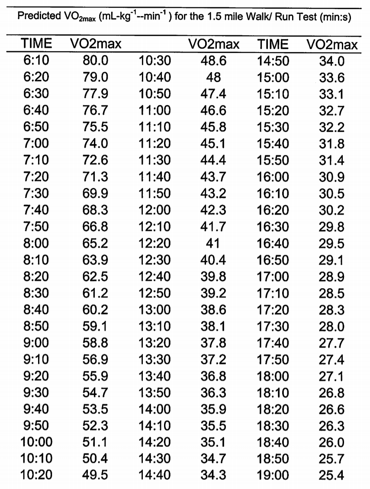

# What is health?

## Vo2 Max
[Vo2 max in wikipedia](https://en.wikipedia.org/wiki/VO2_max)

[Vo2 max self assest test](https://www.strongfirst.com/community/threads/diy-vo2-max-testing.9045/)

Predicted V02max (mL-kg-1--min-1) for the 1.5 mile Walk/ Run Test (min:s)
|TIME|VO2max| |VO2max|TIME|VO2max|
|---|---|---|---|---|---|
|6:10|80.0|10:30|48.6|14:50|34.0|
|6:20|79.0|10:40|48.0|15:00|33.6|
|6:30|77.9|10:50|47.4|15:10|33.1|
|6:40|76.7|11:00|46.6|15:20|32.7|
|6:50|75.5|11:10|45.8|15:30|32.2|
|7:00|74.0|11:20|45.1|15:40|31.8|
|7:10|72.6|11:30|44.4|15:50|31.4|
|7:20|71.3|11:40|43.7|16:00|30.9|
|7:30|69.9|11:50|43.2|16:10|30.5|
|7:40|68.3|12:00|42.3|16:20|30.2|
|7:50|66.8|12:10|41.7|16:30|29.8|
|8:00|65.2|12:20|41.0|16:40|29.5|
|8:10|63.9|12:30|40.4|16:50|29.1|
|8:20|62.5|12:40|39.8|17:00|28.9|
|8:30|61.2|12:50|39.2|17:10|28.5|
|8:40|60.2|13:00|38.6|17:20|28.3|
|8:50|59.1|13:10|38.1|17:30|28.0|
|9:00|58.8|13:20|37.8|17:40|27.7|
|9:10|56.9|13:30|37.2|17:50|27.4|
|9:20|55.9|13:40|36.8|18:00|27.1|
|9:30|54.7|13:50|36.3|18:10|26.8|
|9:40|53.5|14:00|35.9|18:20|26.6|
|9:50|52.3|14:10|35.5|18:30|26.3|
|10:00|51.1|14:20|35.1|18:40|26.0
|10:10|50.4|14:30|34.7|18:50|25.7|
|10:20|49.5|14:40|34.3|19:00|25.4|
